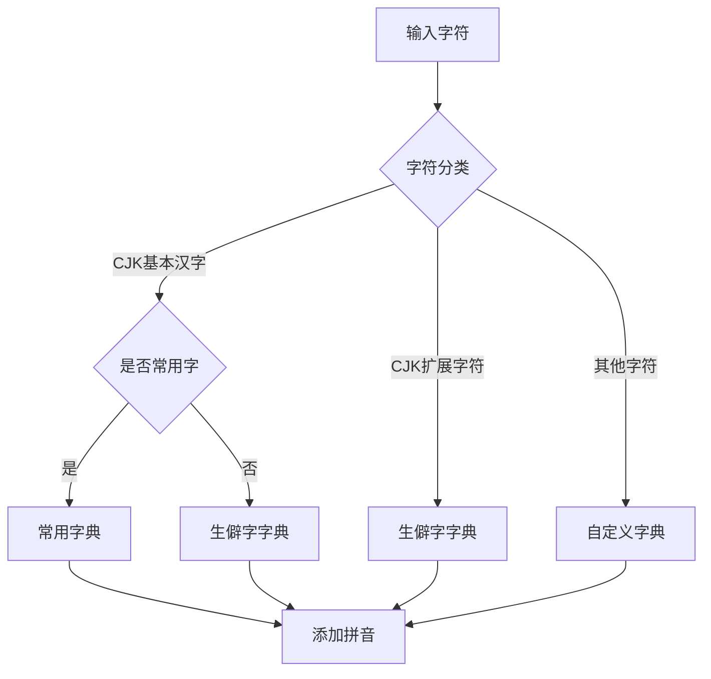

# BackgroundTaskManager 后台任务管理器

## 📋 概述

`BackgroundTaskManager` 是一个智能的后台任务处理系统，专门用于处理拼音转换过程中遇到的未识别字符。它能够自动从外部数据源获取拼音信息，并根据字符性质智能分配到合适的字典中。

## 🏗️ 核心功能

### 1. **任务管理**
- 创建、执行、监控后台任务
- 优先级调度（1-10级，1为最高）
- 失败重试机制（最多3次）
- 并发控制（默认最多3个并发任务）dui

### 2. **字符识别与处理**
- 自动识别未找到拼音的字符
- 智能字符分类（常用字、生僻字、CJK扩展字符等）
- 多层级拼音获取策略

### 3. **字典管理**
- 智能字典分配策略
- 自动字典文件更新
- 字典文件格式维护

## 📁 文件结构

```
src/
├── BackgroundTaskManager.php      # 后台任务管理器主类
└── Utils/
    └── AutoPinyinFetcher.php     # 外部拼音获取工具
```

## 🔧 安装与配置

### 基本配置

```php
use tekintian\pinyin\BackgroundTaskManager;

$config = [
    'enable' => true,                    // 是否启用后台任务
    'task_dir' => '/path/to/tasks/',     // 任务文件存储目录
    'max_concurrent' => 3,               // 最大并发任务数
    'task_types' => []                    // 自定义任务类型
];

$taskManager = new BackgroundTaskManager($config);
```

### 配置参数说明

| 参数 | 类型 | 默认值 | 说明 |
|------|------|--------|------|
| `enable` | bool | `true` | 是否启用后台任务处理 |
| `task_dir` | string | `../data/backup/tasks/` | 任务文件存储目录 |
| `max_concurrent` | int | `3` | 最大并发任务数 |
| `task_types` | array | `[]` | 自定义任务类型配置 |

## 🚀 使用方法

### 1. 创建后台任务

```php
// 创建未找到字符处理任务
$success = $taskManager->createTask(
    'not_found_resolve',     // 任务类型
    ['char' => '䶮'],         // 任务数据
    5                        // 优先级（1-10）
);

if ($success) {
    echo "任务创建成功！";
}
```

### 2. 批量处理任务

```php
// 批量处理待处理任务
$results = $taskManager->processBatch($pinyinConverter, 10);

print_r($results);
/* 输出示例：
[
    'processed' => 5,    // 已处理任务数
    'succeeded' => 4,    // 成功任务数
    'failed' => 1        // 失败任务数
]
*/
```

### 3. 获取任务统计

```php
$stats = $taskManager->getStats();

print_r($stats);
/* 输出示例：
[
    'total' => 15,       // 总任务数
    'pending' => 3,      // 待处理任务
    'running' => 2,      // 执行中任务
    'completed' => 8,    // 已完成任务
    'failed' => 2        // 失败任务
]
*/
```

## 🔍 任务类型详解

### 1. `not_found_resolve` - 未找到字符处理

**功能**：自动处理未找到拼音的字符

**任务数据格式**：
```php
[
    'char' => '䶮'  // 需要处理的汉字
]
```

**处理流程**：
1. 从 Unihan 权威字典查找拼音
2. 如果找不到，调用外部 API 获取拼音
3. 根据字符性质分配到合适的字典
4. 从未找到字符列表中移除

### 2. `self_learn_merge` - 自学习字典合并

**功能**：执行自学习字典的合并操作

**任务数据格式**：
```php
[
    // 可包含合并参数
]
```

## 🔄 字符处理流程

### 字符分类策略



### 拼音获取优先级

1. **第一优先级**：Unihan 权威字典 (`data/unihan/all_unihan_pinyin.php`)
2. **第二优先级**：外部 API（汉典网 + 字典API）
3. **第三优先级**：字符结构推测

## 📊 字典分配策略

| 字符类型 | Unicode 范围 | 目标字典 | 说明 |
|----------|---------------|----------|------|
| 常用汉字 | U+4E00 - U+9FFF | `common_xxx.php` | 在常用字典中存在的字符 |
| 生僻汉字 | U+4E00 - U+9FFF | `rare_xxx.php` | 不在常用字典中的字符 |
| CJK扩展A | U+3400 - U+4DBF | `rare_xxx.php` | CJK扩展A区字符 |
| CJK扩展B-G | U+20000 - U+2EBEF | `rare_xxx.php` | CJK扩展B-G区字符 |
| 其他字符 | 其他范围 | `custom_xxx.php` | 用户自定义符号等 |

## 🔌 外部数据源集成

### AutoPinyinFetcher 集成

`BackgroundTaskManager` 与 `AutoPinyinFetcher` 紧密集成，支持多种拼音获取方式：

```php
// 调用顺序：DictAPI → 汉典网
$result = $fetcher->getPinyinFromDictAPI($char) ?? $fetcher->getPinyinFromZdic($char);
```

### 支持的数据源

1. **汉典网 (zdic.net)** - 主要数据源
2. **字典API** - 备用数据源
3. **Unihan 权威字典** - 本地权威数据

## 🛠️ 高级用法

### 自定义任务类型

```php
// 扩展任务处理逻辑
class CustomTaskManager extends BackgroundTaskManager
{
    protected function executeTaskByType(array $task, PinyinConverter $converter): bool
    {
        switch ($task['type']) {
            case 'custom_task':
                return $this->handleCustomTask($task['data'], $converter);
            default:
                return parent::executeTaskByType($task, $converter);
        }
    }
    
    private function handleCustomTask(array $data, PinyinConverter $converter): bool
    {
        // 自定义任务处理逻辑
        return true;
    }
}
```

### 错误处理与日志

```php
// 启用详细日志
ini_set('error_log', '/path/to/error.log');

// 监控任务执行状态
$taskManager->processBatch($converter);
$stats = $taskManager->getStats();

if ($stats['failed'] > 0) {
    // 处理失败任务
    error_log("有 {$stats['failed']} 个任务执行失败");
}
```

## 📈 性能优化

### 并发控制
- 默认最大并发数：3
- 可配置并发限制
- 任务优先级调度

### 文件操作优化
- 批量文件读写
- 文件锁机制
- 异常恢复机制

### 内存管理
- 按需加载字典
- 任务数据序列化
- 自动垃圾回收

## 🐛 故障排除

### 常见问题

**Q: 任务创建失败**
A: 检查任务目录权限和磁盘空间

**Q: 外部API调用失败**
A: 检查网络连接和API可用性

**Q: 字典文件无法更新**
A: 检查文件权限和磁盘空间

### 调试模式

```php
// 启用调试模式
$config = [
    'enable' => true,
    'debug' => true  // 启用详细日志
];

$taskManager = new BackgroundTaskManager($config);
```

## 📝 版本历史

| 版本 | 日期 | 说明 |
|------|------|------|
| 1.0.0 | 2025-11-07 | 初始版本，支持基本任务管理 |
| 1.1.0 | 2025-11-11 | 集成 AutoPinyinFetcher，优化字符分类 |

## 🔗 相关文档

- [PinyinConverter 文档](./PinyinConverter.md)
- [AutoPinyinFetcher 文档](./AutoPinyinFetcher.md)
- [字典优先级说明](./字典优先级.md)

## 📄 许可证

本项目基于 MIT 许可证开源。

---

**最后更新**：2025年11月12日17:15:58  
**维护者**：tekintian